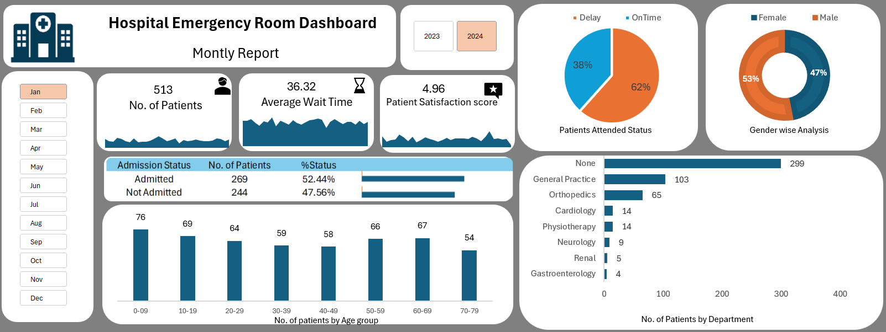
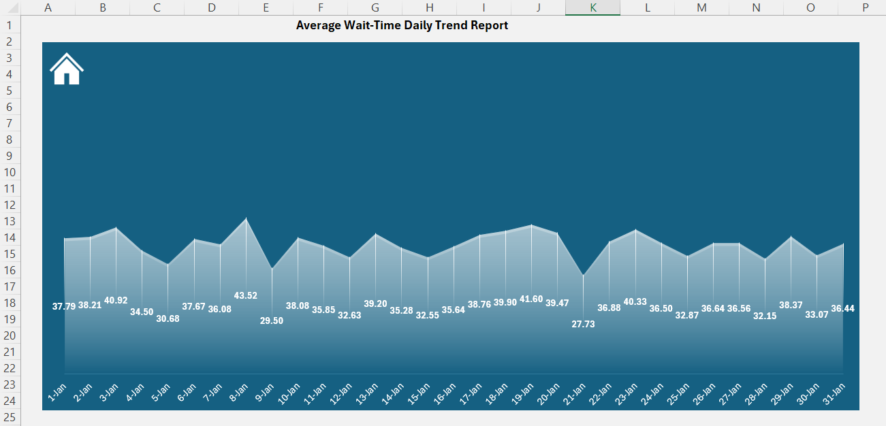
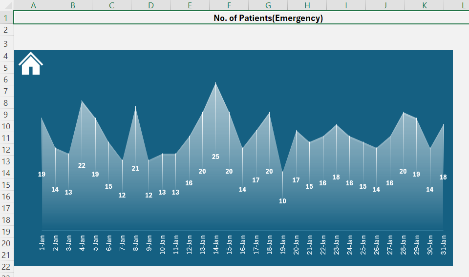
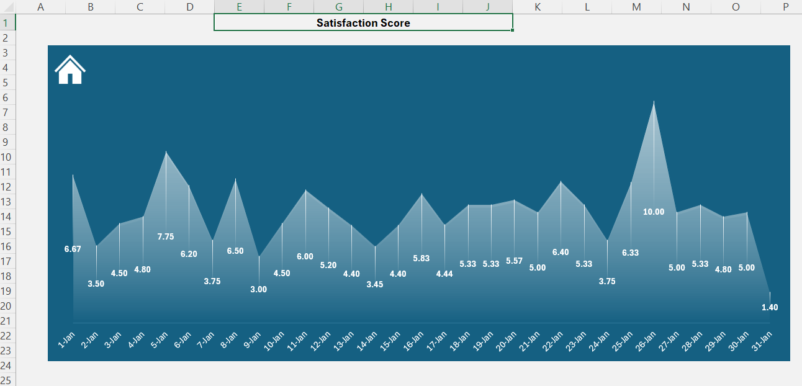

<p align="center">
  
</p>

# 🏥 Hospital Emergency Room Dashboard

## 📌 Project Overview

The **Hospital Emergency Room Dashboard** is an interactive Microsoft Excel dashboard project designed to analyze and visualize emergency room operations data.

This dashboard helps monitor:

* Patient flow
* Average waiting time
* Patient satisfaction score
* Admission status
* Gender analysis
* Department-wise patient flow
* Daily emergency patient trends

The project demonstrates strong skills in:

* Microsoft Excel
* Data Cleaning
* Pivot Tables
* Pivot Charts
* Dashboard Design
* KPI Reporting
* Data Visualization
* Interactive Reporting

---

# 📊 Dashboard Preview

## 🏥 Main Dashboard

<p align="center">
  
</p>

* Displays overall ER performance metrics
* Includes KPIs, charts, filters, and department analysis

### Key Metrics:

* Total Number of Patients
* Average Wait Time
* Patient Satisfaction Score
* Admission Status
* Gender-wise Analysis
* Department-wise Patient Count
* Age Group Analysis

---

## 📈 Additional Reports

### 1. Average Wait-Time Daily Trend Report

Tracks the daily average waiting time of emergency patients.

<p align="center">
  
</p>

### 2. Daily Emergency Patient Count Report

Shows the number of emergency patients visiting each day.

<p align="center">
  
</p>

### 3. Satisfaction Score Report

Analyzes daily patient satisfaction scores.

<p align="center">
  
</p>

---

# 🛠 Tools & Technologies Used

| Tool                   | Purpose               |
| ---------------------- | --------------------- |
| Microsoft Excel        | Dashboard Development |
| Pivot Tables           | Data Aggregation      |
| Pivot Charts           | Data Visualization    |
| Slicers                | Interactive Filtering |
| Conditional Formatting | Visual Insights       |
| CSV Dataset            | Data Source           |

---

# 📂 Recommended Project Structure

```bash
Hospital-Emergency-Dashboard/
│
├── Images/
│   ├── main_dashboard.png
│   ├── average_wait_time.png
│   ├── emergency_patients.png
│   ├── satisfaction_score.png
│   └── hospital_logo.png
│
├── Hospital management dashboard.xlsx
├── Hospital Emergency Room Data.csv
├── README.md
```

---

# 📂 Project Files

| File Name                            | Description                   |
| ------------------------------------ | ----------------------------- |
| `Hospital management dashboard.xlsx` | Main Excel dashboard project  |
| `Hospital Emergency Room Data.csv`   | Raw dataset used for analysis |
| Dashboard Images                     | Dashboard preview screenshots |

---

# 📑 Dataset Information

The dataset contains hospital emergency room operational data including:

* Patient Count
* Admission Status
* Gender
* Department Referrals
* Wait Time
* Satisfaction Scores
* Age Groups
* Daily Patient Visits

---

# 🎯 Dashboard Features

## ✅ Interactive Filters

* Month-wise filtering
* Year-wise filtering

## ✅ KPI Cards

* Total Patients
* Average Wait Time
* Satisfaction Score

## ✅ Visualizations Included

* Area Charts
* Bar Charts
* Donut Charts
* Trend Analysis Charts
* Department-wise Comparison Charts

## ✅ Data Insights

* Identify peak patient days
* Monitor patient waiting trends
* Analyze department workload
* Understand patient satisfaction patterns

---

# 📌 Dashboard Sheets Included

| Sheet Name                      | Purpose                      |
| ------------------------------- | ---------------------------- |
| `Dashboard`                     | Main interactive dashboard   |
| `Average wait time daily trend` | Daily wait time analysis     |
| `Daily ER No of patients`       | Daily patient count report   |
| `Satisfaction score`            | Satisfaction trend analysis  |
| `Pivot Report`                  | Backend pivot analysis       |
| `Hospital Emergency Room Data`  | Raw data sheet               |
| `Calander_Table`                | Calendar table for reporting |

---

# 🚀 How to Use

1. Download the project files.
2. Open `Hosptial management dashboard.xlsx` in Microsoft Excel.
3. Enable editing if prompted.
4. Use slicers and filters to interact with the dashboard.
5. Explore different reports and trends.

---

# 📷 Dashboard Highlights

### ✔ Main ER Dashboard

* Complete emergency room analytics in one view.

### ✔ Wait Time Analysis

* Helps identify operational delays.

### ✔ Satisfaction Monitoring

* Tracks patient experience trends.

### ✔ Department Analysis

* Shows which departments receive the highest referrals.

---

# 💡 Key Learnings From This Project

Through this project, I improved my skills in:

* Excel Dashboard Development
* Data Visualization Techniques
* Pivot Table Reporting
* KPI Design
* Interactive Dashboard Building
* Healthcare Data Analysis
* Report Formatting & UI Design

---


# ⭐ Project Outcome

This project showcases the ability to convert raw healthcare data into meaningful business insights using Excel dashboards and visual analytics.
